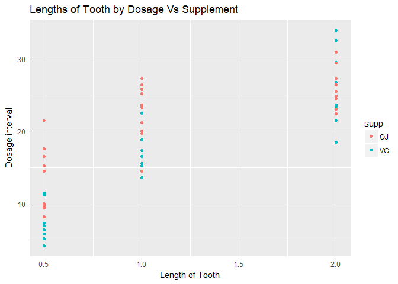
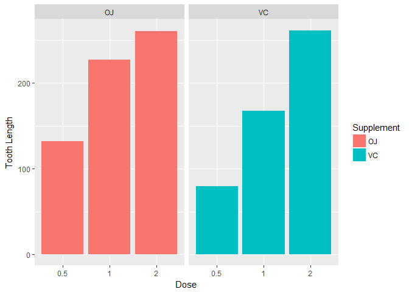

---
output:
  html_document: 
    keep_md: yes
  pdf_document: 
    toc: yes
---
---
title: "Statistical Inference Project 2"
author: "Rahul"
date: "29 December 2017"
output:
  pdf_document: default
  html_document:
    keep_md: yes
----------------------------------------------------------------------------------
we're going to analyze the ToothGrowth data in the R datasets package

Instructions
----------------------------------------------------------------------------------

1) Load the ToothGrowth data and perform some basic exploratory data analysis.
2) Provide a basic summary of the data.
3) Use confidence intervals and/or hypothesis tests to compare tooth growth by supp and dose.
4) State your conclusions and the assumptions needed for your.

Loading required Library

```r
library(data.table)
```

```
## Warning: package 'data.table' was built under R version 3.4.3
```

```r
library(ggplot2)
```

Loading Datset

```r
toothGrowth <- data.table(ToothGrowth)
```

checking few parameters

```r
head(toothGrowth)
```

```
##     len supp dose
## 1:  4.2   VC  0.5
## 2: 11.5   VC  0.5
## 3:  7.3   VC  0.5
## 4:  5.8   VC  0.5
## 5:  6.4   VC  0.5
## 6: 10.0   VC  0.5
```

```r
str(toothGrowth)
```

```
## Classes 'data.table' and 'data.frame':	60 obs. of  3 variables:
##  $ len : num  4.2 11.5 7.3 5.8 6.4 10 11.2 11.2 5.2 7 ...
##  $ supp: Factor w/ 2 levels "OJ","VC": 2 2 2 2 2 2 2 2 2 2 ...
##  $ dose: num  0.5 0.5 0.5 0.5 0.5 0.5 0.5 0.5 0.5 0.5 ...
##  - attr(*, ".internal.selfref")=<externalptr>
```

Finding all unique values for each causal factor

```r
unique(toothGrowth$supp)
```

```
## [1] VC OJ
## Levels: OJ VC
```

```r
unique(toothGrowth$dose)
```

```
## [1] 0.5 1.0 2.0
```

A data frame with 60 observations on 3 variables.There are two levels (delivery types) for supplement: "OJ" and "VC".

------------------------------------------------
Let's Put graphical presentation of data
--------------------------------------------------


```r
ggplot(aes(x=dose, y = len), data = toothGrowth) + 
     labs(x = "Length of Tooth", y = "Dosage interval", title = "Lengths of Tooth by Dosage Vs Supplement")         +geom_point(aes(color = supp))
```

<!-- -->


```r
ggplot(data=toothGrowth, aes(x=as.factor(dose), y=len, fill=supp)) +
    geom_bar(stat="identity") +
    facet_grid(. ~ supp) +
    xlab("Dose") +
    ylab("Tooth Length") +
    guides(fill=guide_legend(title="Supplement"))
```

<!-- -->

conclusion: It seems to be an impact on tooth growth by increasing the dose but it is not clear by which supplements contributes to the growth.

#confidence intervals and/or hypothesis tests to compare tooth growth by supp and dose.

Use t.test to determine if there is a difference in the performance of the treatments. First, we will run the test based on supplement. Looking to see if the p-value > 0.05 and if the confidence interval crosses to zero.


```r
t.test(toothGrowth$len[toothGrowth$supp=="OJ"], toothGrowth$len[toothGrowth$supp=="VC"], paired = FALSE, var.equal = FALSE)
```

```
## 
## 	Welch Two Sample t-test
## 
## data:  toothGrowth$len[toothGrowth$supp == "OJ"] and toothGrowth$len[toothGrowth$supp == "VC"]
## t = 1.9153, df = 55.309, p-value = 0.06063
## alternative hypothesis: true difference in means is not equal to 0
## 95 percent confidence interval:
##  -0.1710156  7.5710156
## sample estimates:
## mean of x mean of y 
##  20.66333  16.96333
```

The p-value is 0.06063 and the confidence interval is [-0.1710156 7.5710156], thus containing 0.
p-value is 0.06063, there is not enough evidence to reject the null hypothesis.as we
cannot assume the delivery type has a significant effect on tooth growth.

Test the tooth length comparing the dosage of 1mg to 2mg to determine the effects of an increased dosage.

```r
t.test(toothGrowth$len[toothGrowth$dose==2], toothGrowth$len[toothGrowth$dose==1], paired = FALSE, var.equal = TRUE)
```

```
## 
## 	Two Sample t-test
## 
## data:  toothGrowth$len[toothGrowth$dose == 2] and toothGrowth$len[toothGrowth$dose == 1]
## t = 4.9005, df = 38, p-value = 1.811e-05
## alternative hypothesis: true difference in means is not equal to 0
## 95 percent confidence interval:
##  3.735613 8.994387
## sample estimates:
## mean of x mean of y 
##    26.100    19.735
```

we see the p-value is still small although slighty larger than the previous test, therefore, it is significant.

We can again reject the null hypothesis and assume the dosage increase from .5mg to 1mg creates an positive effect on tooth growth.

#conclusions
The delivery type does not show a significant increase in tooth growth even though it does have a confidence level that crosses 0 at the 95% confidence.

However, there does appear to be a difference with an increase in tooth growth when the dosage is increased. The tests comparing the dosage show confidence intervals of differences never crossing zero
hence we can conclude that Increasing the dosage leads to an increase in tooth growth in guinea pigs.

